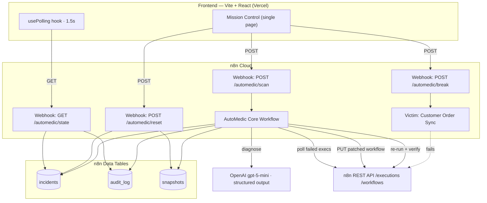

# n8n AutoMedic — Self-Healing Workflow Engine
## 24-Hour Hackathon POC Plan

---

## 1. One-Liner & Thesis

**One-liner:** AutoMedic watches your n8n workflows, and when one breaks it diagnoses the failure with an LLM, patches the broken workflow itself, re-runs it, and proves the fix worked — in under 60 seconds, with no human in the loop.

**Hackathon thesis:** Automation platforms have made it trivial to *build* integrations and still impossible to *keep them alive*. Every team with 50+ workflows has a graveyard of silently broken jobs, and the fix is almost always boring: an upstream API renamed a field. AutoMedic proves that the boring 80% of automation breakage is machine-repairable today, and that the right interface for it is an incident timeline, not an alert channel.

**What we are actually proving in 24 hours:** one narrow failure class (`FIELD_MAPPING`) repaired autonomously, end to end, visibly, repeatably, on demand. Depth over breadth. A judge should leave able to explain the loop to someone else.

**What we are explicitly not proving:** that it is safe on every failure class, production-hardened, multi-tenant, or cheap at scale. We will say so out loud in the demo — it reads as engineering maturity, not as a gap.

---

## 2. Demo Story (2–3 Minutes)

The demo is a single browser tab. No n8n canvas unless a judge asks. Total runtime target: **2:15**, hard ceiling **3:00**.

**Setup shown on screen (0:00–0:20)**
AutoMedic Mission Control is open. Status pill reads `WATCHING · 3 workflows`. One watched workflow is *Customer Order Sync* — green, last run OK. Presenter: "This is a healthy n8n workflow syncing orders into a CRM. AutoMedic is watching it."

**Break it (0:20–0:40)**
Presenter clicks **Break the API**. On-screen toast: "Upstream vendor renamed `email` → `email_address`." The workflow card flips to red, an incident card appears, and the timeline starts: `DETECTED — execution 8842 failed at node "Create CRM Contact"`. Presenter: "A vendor shipped a breaking change overnight. Classic. In a real team this is discovered three days later by a customer."

**Diagnose (0:40–1:15)**
Timeline advances live: `DIAGNOSING…` → `DIAGNOSED`. The diagnosis panel fills in:
- Category: `FIELD_MAPPING`
- Confidence: `0.93`
- Auto-repair safe: `true`
- Reasoning: "Node references `$json.customerEmail`; upstream payload exposes `email_address`. Rename the source field reference."
- Available fields observed: `order_id, email_address, total, currency`

Presenter: "The model isn't guessing from the error string alone — it sees the failed node's parameters *and* the actual JSON that flowed into it."

**Gate (1:15–1:30)**
Timeline: `GATE PASSED — FIELD_MAPPING + safe + 0.93 ≥ 0.80`. Presenter: "This is the important part. AutoMedic only touches the workflow for failure classes we've allow-listed, above a confidence floor. An `AUTH_EXPIRED` or `UNKNOWN` gets escalated to a human, never patched." (Have a second, pre-seeded incident card visible showing exactly that: `ESCALATED — AUTH_EXPIRED, no auto-repair`.)

**Patch (1:30–1:55)**
Timeline: `PATCHING`. The diff panel animates in — a real before/after of the workflow node parameters, one red line, one green line. Timeline: `WORKFLOW UPDATED — v7 → v8, snapshot saved`.

**Heal & verify (1:55–2:15)**
Timeline: `RE-RUNNING execution 8842` → `VERIFIED — execution 8847 succeeded in 1.8s`. Workflow card flips back to green. Stats bar increments: `Auto-healed: 1 · MTTR: 47s · Human touches: 0`.

**Close (2:15–2:30)**
Presenter: "Detected, diagnosed, patched, re-ran, verified — 47 seconds, nobody paged. Every action is in an audit log with a one-click rollback to the pre-patch snapshot." Click the rollback button to show it exists (don't run it).

**Judge Q&A ammo (don't say unless asked):** confidence gate + allow-list, snapshot/rollback, AutoMedic excludes its own workflows from watching, one repair attempt per workflow per window (circuit breaker), and the honest statement that field-mapping is the only class we auto-patch today.

---

## 3. Architecture

Deliberately thin. The frontend owns **no business logic** — it triggers webhooks and renders state from a single read endpoint. All intelligence stays in n8n where it already lives.

**Stack decisions (locked, do not relitigate at hour 14):**

| Layer | Choice | Why |
|---|---|---|
| Frontend | Vite + React + TypeScript | Fastest cold start; no SSR/routing needs. Next.js buys us nothing here. |
| Styling | Tailwind + shadcn/ui | Cards, badges, dialogs, diff panels for free. |
| Animation | Framer Motion, 3 uses max | Timeline step entry, diff reveal, status pill. Nothing else. |
| State | TanStack Query polling `/state` every 1.5s | No websockets. No Redux. Polling is invisible to judges and unbreakable. |
| Transport | n8n Webhook nodes returning JSON | Zero extra services to deploy or debug at 3am. |
| Persistence | n8n Data Tables (already in use) | Already wired. **Do not migrate to Supabase** — only add Supabase if Data Table reads prove too slow to query, and only for the read-side `/state` endpoint. |
| Hosting | Vercel (frontend), n8n Cloud (backend) | Also keep `npm run dev` + a recorded video as the two fallbacks. |
| Auth | None | It's a demo. A hardcoded shared secret in the webhook header is enough to stop random traffic. |

**The `/state` contract is the single most important artifact of this project.** Freeze it at hour 3, mock it immediately, and let both tracks build against it independently.

> **Frozen contract (issue #1):** see [`contracts/`](./contracts/) — `state.example.json`, `state.reset.example.json`, `state.ts`, `state.schema.json`.

---

## 4. Must-Have vs Nice-to-Have vs Cut

### Must-have (demo dies without these)
1. `POST /break` reliably produces exactly one `FIELD_MAPPING` failed execution, within 5 seconds, every time.
2. `POST /scan` runs AutoMedic on demand and returns immediately (fire-and-forget) — **no waiting on the 1-minute schedule during a demo.**
3. Diagnosis persists to the `incidents` table with category, confidence, `autoRepairSafe`, reasoning, and observed field names.
4. Patch applies, workflow PUTs successfully, pre-patch snapshot is stored.
5. Re-run executes and verification correctly reports success.
6. `GET /state` returns everything the UI needs in one call, in under ~500ms.
7. Mission Control renders: workflow health cards, live incident timeline, diagnosis panel, before/after diff, stats bar.
8. `POST /reset` returns the whole demo to a clean state in under 10 seconds. **This is a must-have, not a nice-to-have** — you will run the demo 30+ times today.
9. A second, pre-seeded `AUTH_EXPIRED → ESCALATED` incident to demonstrate the gate refusing to act.

### Nice-to-have (build only if ahead of schedule at hour 17)
- Rollback button that actually restores the snapshot (having the button and saying "one-click rollback" is enough for the demo; wiring it is a bonus).
- Slack post on heal — **only** if a real channel + bot token take under 15 minutes. Otherwise the UI notification pane *is* the notification story.
- Sound effect / confetti on successful heal. Cheap, surprisingly effective on judges.
- "Time saved" counter with a plausible assumption stated on screen.
- Live tail of raw n8n execution JSON in a collapsible drawer (good for the technical judge).
- A third failure class diagnosed-but-not-patched (`RATE_LIMIT`) to show breadth of *classification*.

### Cut (say no, write it on a wall)
- Any auth, login, user accounts, multi-tenancy, org switching.
- Repairing anything other than `FIELD_MAPPING`.
- Real credential refresh for `AUTH_EXPIRED`.
- A settings/config UI (thresholds, watched workflows) — hardcode them, show them as read-only text.
- Historical analytics, charts over time, trend lines.
- Mobile responsiveness beyond "doesn't visibly explode on a laptop".
- Tests, CI, Docker, error boundaries beyond one top-level fallback.
- Dark/light theme toggle. Pick dark, move on.
- Websockets / SSE / optimistic UI.
- Onboarding flow, empty states beyond one line of text.
- Migrating data off n8n Data Tables.
- Making it work on someone else's n8n instance.

---

## 5. Hour-by-Hour 24-Hour Schedule

Two parallel tracks. **Track A = n8n/backend**, **Track B = frontend**. Solo+AI: run A first through hour 8, then B, and steal from the polish budget.

T+0 is kickoff. Sleep is scheduled, not optional — a presenter who hasn't slept loses the room.

### Phase 1 — Prep & Contract (T+0 → T+3)

| Hour | Track A (n8n) | Track B (frontend) |
|---|---|---|
| **T+0–1** | Audit current AutoMedic: list every node, confirm API creds work, confirm Data Tables readable. Disable the 1-min schedule. | Scaffold Vite + TS + Tailwind + shadcn. Deploy the empty shell to Vercel *now* — never leave deploy to the end. |
| **T+1–2** | **Both together: freeze the `/state` JSON contract.** Write it down as a fixed example payload. This is the only meeting of the day. | |
| **T+2–3** | Build the victim workflow "Customer Order Sync" in its healthy form; run it green. | Build the mock `/state` server (a static JSON file served locally) and the polling hook against it. |

**Exit gate T+3:** contract frozen; frontend polls a mock and renders *something*; victim workflow runs green.

### Phase 2 — Core Loop (T+3 → T+9)

| Hour | Track A | Track B |
|---|---|---|
| **T+3–4** | Build `POST /break`: swap victim's mapping node to the broken field reference, then execute it. Verify it produces a failed execution with a rich, readable error. | Workflow health cards + status pill + stats bar, all from mock data. |
| **T+4–6** | Rework AutoMedic scan: filter by tag `automedic:watch`, look back 10 minutes only, cap 5 executions, hard-exclude AutoMedic's own workflow IDs. Add `POST /scan` webhook entry point. | Incident timeline component — the centerpiece. Steps, states (pending/active/done/failed/skipped), timestamps, animated entry. |
| **T+6–7** | Diagnosis node: verify structured output shape matches the contract exactly. Persist the full diagnosis to `incidents`. | Diagnosis panel: category badge, confidence meter, safe/unsafe indicator, reasoning text, observed-fields chips. |
| **T+7–9** | Patcher: snapshot workflow JSON to `snapshots` before touching it, scope the string replace to the failing node's parameters only, PUT, record before/after strings in `audit_log`. | Before/after diff panel (red/green line diff, not a full diff library — two `<pre>` blocks with highlighted lines is plenty). |

**Exit gate T+9:** breaking, diagnosing, and patching all work when triggered by hand; frontend renders all four panels from mock data.

### Phase 3 — Integrate (T+9 → T+13)

| Hour | Both tracks |
|---|---|
| **T+9–10** | Re-run + verify: poll the re-run execution until terminal with a 60s timeout and 2s interval. **No fixed sleeps.** Write the verified result to `incidents`. |
| **T+10–11** | Build `GET /state` for real, reading `incidents` + `audit_log`. Match the frozen contract byte for byte. |
| **T+11–12** | **First real integration.** Point the frontend at the live webhook. Expect this to be ugly. Budget the full hour for shape mismatches. |
| **T+12–13** | Build `POST /reset`. Then run the full loop five times in a row from a clean state. Fix whatever is flaky. Commit a known-good state and tag it. |

**Exit gate T+13 — THE HARD DEADLINE:** *the end-to-end demo works once, live, with real data.* If this gate slips, cut the nice-to-have list to zero and cut the second escalated incident. Nothing after this point is allowed to break the loop.

### Phase 4 — Sleep (T+13 → T+19)

Sleep. Six hours. If two builders, one may take a 2-hour polish shift and then sleep. Do not skip this. Before sleeping: push everything, verify the Vercel deploy is green, and record a 3-minute screen capture of the working demo as the disaster fallback.

### Phase 5 — Polish (T+19 → T+22)

| Hour | Work |
|---|---|
| **T+19–20** | Visual pass: spacing, typography, dark theme, the three Framer Motion animations. Make the timeline look expensive. |
| **T+20–21** | Seed the `AUTH_EXPIRED → ESCALATED` incident. Add the copy that explains the gate on screen (judges read the UI while you talk). |
| **T+21–22** | Nice-to-haves, strictly in list order, strictly time-boxed. Stop at the top of the hour regardless of where you are. |

### Phase 6 — Rehearse (T+22 → T+24)

| Hour | Work |
|---|---|
| **T+22–23** | Run the demo start to finish **five times**, timed, out loud, with reset between each. Write the runbook (section 11). Fix only demo-blocking bugs. |
| **T+23–24** | Freeze code. Two more dry runs. Prepare Q&A answers. Charge everything, download the fallback video locally, set up the browser (tabs, zoom to 125%, notifications off). |

**Code freeze at T+23. No exceptions.** More hackathon demos die to a 3am "quick fix" than to missing features.

---

## 6. Frontend Screens & Components

One route. One screen. Dark theme.

**Layout:** full-height three-zone grid — header bar, main split (left rail 280px / center flex / right rail 420px), footer stats bar.

| Component | Content | Notes |
|---|---|---|
| `HeaderBar` | Product name, status pill (`WATCHING` / `SCANNING` / `HEALING` / `HEALED`), last-scan timestamp | Status pill color is the fastest signal in the room. Make it big. |
| `DemoControls` | Three buttons: **Break the API**, **Scan Now**, **Reset Demo** | In the header, right-aligned. `Reset` gets a subdued style so you never misclick it mid-demo. |
| `WorkflowHealthRail` | Left rail. One card per watched workflow: name, health dot, last execution id + result, "watched" tag | 3 workflows; only one ever breaks. The other two being green is what makes "watching" believable. |
| `IncidentTimeline` | Center. Vertical stepper: `DETECTED → DIAGNOSING → DIAGNOSED → GATE → PATCHING → PATCHED → RE-RUNNING → VERIFIED` | Each step: icon, label, one-line detail, relative timestamp, duration. Steps animate in as the poll discovers them. Failed/escalated paths render the gate step in amber and terminate with `ESCALATED TO HUMAN`. |
| `DiagnosisPanel` | Right rail, top. Category badge, confidence bar, auto-repair-safe indicator, model reasoning, observed-field chips | Show the confidence threshold (`≥ 0.80`) as a marker on the bar. Judges love a visible threshold. |
| `PatchDiffPanel` | Right rail, bottom. Node name, before/after parameter strings with the changed line highlighted, workflow version bump, **Rollback** button | The single most persuasive element. Spend real time making it legible. |
| `IncidentList` | Collapsible strip above the timeline: prior incidents, selectable | Needed only to surface the pre-seeded `AUTH_EXPIRED` escalation. Two items max. |
| `StatsBar` | Footer: auto-healed count, MTTR, human touches, (optional) time saved | Increments visibly on heal. |
| `ActivityToasts` | Bottom-right transient toasts mirroring timeline transitions | This is the Slack replacement. Frame it that way when presenting. |

**Build order:** Timeline → Diagnosis → Diff → Health rail → Stats → Controls → Toasts. If you run out of time, the last two are droppable; the first three are the demo.

---

## 7. Backend / n8n Checklist

Fixes to the existing AutoMedic, in priority order.

**Trigger & scan hygiene**
- [ ] Deactivate the 1-minute schedule for the duration of the hackathon. Re-enable only as a talking point ("in production it runs every minute"), never during a live demo.
- [ ] Add a `POST /automedic/scan` webhook as the demo entry point; respond `202` immediately and continue the workflow asynchronously so the UI never blocks.
- [ ] Scope the failed-execution query: only workflows tagged `automedic:watch`, only executions finished in the last 10 minutes, cap at 5 per scan, oldest first.
- [ ] **Hard-exclude AutoMedic's own workflow IDs from the watch set**, by ID and by tag. A self-diagnosing, self-patching AutoMedic is a fun story and a catastrophic demo.
- [ ] Keep the Data Table dedup on `execution_id`; add a second guard: at most one repair attempt per workflow per 15 minutes (circuit breaker). Record skipped attempts as `SUPPRESSED` so the UI can show the breaker working.

**Diagnosis**
- [ ] Lock the structured-output schema to exactly the fields the `/state` contract needs — category, confidence, `autoRepairSafe`, reasoning, `sourceField`, `targetField`, `observedFields`, `failedNodeName`.
- [ ] Feed the model the failed node's parameters *and* the input JSON keys, not just the error message. This is what makes the reasoning quotable in the demo.
- [ ] Cap the input JSON sent to the model (keys + truncated sample values) so token cost and latency stay predictable.
- [ ] Add a deterministic fallback: if the model call fails or returns malformed output, write an `UNKNOWN` incident rather than throwing. The demo must degrade to "escalated to human", never to a red n8n canvas.

**Gate**
- [ ] Keep the gate exactly as designed: `FIELD_MAPPING && autoRepairSafe && confidence >= 0.8`.
- [ ] Emit a timeline event for *both* outcomes. The refusal path is a feature — it needs to be visible.

**Patcher**
- [ ] Snapshot the full workflow JSON to `snapshots` **before** any mutation, keyed by incident id.
- [ ] Constrain the string replace: only within the parameters of the node named in the diagnosis, only replacing the exact `sourceField` token, and abort if the replacement count is 0 or greater than 3. Write the replacement count into the audit log.
- [ ] Re-fetch the workflow immediately before PUT to avoid clobbering concurrent edits.
- [ ] Store before/after parameter strings for the diff panel.

**Re-run & verify**
- [ ] Replace any fixed wait with a poll loop: check execution status every 2s, terminate on `success`/`error`/`crashed`, hard timeout at 60s → mark `VERIFY_TIMEOUT`.
- [ ] Verify the *new* execution id, not the original. Record both.
- [ ] On verified failure, mark the incident `REPAIR_FAILED` and surface the rollback affordance.

**Notifications & audit**
- [ ] Remove or disable every placeholder Slack node. A red Slack node in a live run is a visible failure for zero demo value.
- [ ] Route all notifications to the `audit_log` table; the frontend toasts read from it. Add real Slack only if a channel is wired in under 15 minutes.
- [ ] Ensure every state transition writes one row to `audit_log` with incident id, step, status, message, timestamp. The timeline is literally a render of this table — get the write coverage right and the UI is free.

**Read API**
- [ ] `GET /automedic/state` joins `incidents` + `audit_log` + a static watched-workflow list into the frozen contract shape. Add a shared-secret header check.
- [ ] `POST /automedic/reset`: clear `incidents`, `audit_log`, dedup rows, and restore the victim workflow to its healthy snapshot. Must finish in under 10 seconds.

---

## 8. Seed Data & Victim Workflow

**Victim: "Customer Order Sync"** — tagged `automedic:watch`. Four nodes, no external dependencies that can fail on conference wifi:

1. **Manual/Webhook Trigger**
2. **Mock Orders** — a Set/Code node emitting a fixed order payload with keys `order_id`, `email_address`, `total`, `currency`. No real HTTP call. Conference wifi is not a dependency you accept.
3. **Map to CRM Fields** — the patch target. Maps the upstream payload into CRM shape. In the healthy version it reads `email_address`; in the broken version it reads `email`.
4. **Create CRM Contact** — a validation node that throws a deliberately explicit error when the mapped email is missing: something to the effect of *"Required field 'customerEmail' is empty. Input JSON contains: order_id, email_address, total, currency."*

Why a synthetic validation error rather than a real API 4xx: it is deterministic, offline-safe, instant, and it hands the model exactly the signal a real integration error would contain. It is realistic in shape, not fake in substance — say so if asked.

**Two stored workflow variants**, both saved as Data Table rows:
- `victim_healthy` — the known-good JSON, used by `/reset`.
- `victim_broken` — the field-renamed JSON, used by `/break`.

`POST /break` writes `victim_broken` over the live workflow, waits for the PUT to confirm, executes it once, and returns the new execution id so the UI can start its timeline immediately rather than waiting for the next scan.

**Two decoy workflows** — "Invoice Reconciliation" and "Support Ticket Triage", also tagged `automedic:watch`, each a trivial always-succeeding workflow run once during setup so they show a recent green execution. They exist purely so the left rail says "watching 3" truthfully.

**Pre-seeded escalation incident** — one row in `incidents` for a fictional "Stripe Payout Sync" with category `AUTH_EXPIRED`, `autoRepairSafe: false`, confidence `0.91`, status `ESCALATED`. Do not generate this live; hardcode it at reset time. Its only job is to prove the gate refuses to act.

---

## 9. Success Criteria

The POC succeeds if, on demo day:

1. **Reliability:** the full break → diagnose → patch → re-run → verify loop completes successfully in **9 of 10 consecutive attempts** from a clean reset.
2. **Speed:** median wall-clock from clicking *Break the API* to `VERIFIED` is **under 60 seconds**; p90 under 90 seconds.
3. **Legibility:** a judge who has never seen n8n can describe what happened after one viewing, without the presenter re-explaining.
4. **Reset:** `Reset Demo` returns to a clean state in under 10 seconds and works **every** time — this is what lets you demo to five judging tables back to back.
5. **Honesty:** the gate visibly refuses to patch the `AUTH_EXPIRED` incident. AutoMedic is shown to know its own limits.
6. **Self-containment:** the demo runs with no dependency on any third-party API other than OpenAI, and has a mobile-hotspot and a recorded-video fallback.
7. **No raw n8n required:** the entire story lands in the frontend. The canvas is an appendix, opened only on request.

---

## 10. Risks & Mitigations

| Risk | Severity | Mitigation |
|---|---|---|
| **AutoMedic diagnoses/patches itself** — infinite recursion, or it breaks its own patcher mid-demo | Fatal | Deny-list AutoMedic's workflow IDs in the scan query *and* require the `automedic:watch` tag. Two independent guards. Test it explicitly by forcing an AutoMedic failure and confirming nothing is picked up. |
| **1-minute poll noise** — stale executions from earlier runs get re-diagnosed mid-demo, timeline fills with garbage | High | Schedule disabled during the hackathon; demo runs on the manual `/scan` webhook. Lookback window capped at 10 minutes, 5 executions max, dedup on `execution_id`. `Reset` wipes dedup state. |
| **String-replace patching corrupts the workflow** — token appears in unintended places, PUT produces an unopenable workflow | High | Scope replacement to the single diagnosed node's parameters; abort if replacement count is 0 or >3; snapshot before every mutation; `/reset` restores from the stored healthy JSON. Never demo a patch on a workflow you can't restore in one click. |
| **Verify race** — re-run checked before the PUT has propagated, or before the execution finishes, producing a false failure | High | Confirm the PUT by re-reading the workflow version before triggering the re-run; poll the new execution to a terminal state with a 2s interval and 60s timeout; never use fixed sleeps; always verify the *new* execution id. |
| **Slack placeholders fail live** | Medium | Delete/disable them. Notifications are UI toasts sourced from `audit_log`. Frame this as "AutoMedic's own incident feed" — it's a better demo than a Slack screenshot anyway. |
| **LLM latency or a bad structured-output parse** | Medium | `gpt-5-mini`, trimmed input payload, and a deterministic `UNKNOWN` fallback that writes an escalated incident instead of throwing. The demo degrades to "escalated to human", which is still a coherent story. |
| **Contract drift between tracks** | Medium | Freeze `/state` at T+2 and mock it immediately. Any change after T+9 requires both builders to agree out loud. |
| **Integration eats the night** | Medium | T+13 hard gate. If end-to-end isn't working by then, cut every nice-to-have and the decoy workflows, and drive the loop with whatever is stable. |
| **Conference wifi / n8n Cloud hiccup** | Medium | Mobile hotspot pre-tested. Frontend runs locally against the deployed webhooks if Vercel is unreachable. Recorded 3-minute video downloaded to the laptop, opened in a background tab. |
| **Judges ask "would you run this in production?"** | Low | Prepared answer: not on every failure class — today we auto-repair one allow-listed class above a confidence floor, with snapshots and rollback; everything else escalates. That's the deployable version of the idea, and it's the 60–80% of breakage that is pure field drift. |
| **Demo is too slow to hold attention** | Low | Timeline animates continuously so there is never dead air; presenter narrates the gate while patching runs. Rehearse until the talk track covers every wait. |

---

## 11. Day-Of Demo Runbook

### T-60 minutes — Pre-flight
- [ ] Laptop plugged in; sleep, screensaver, and all notifications disabled (Do Not Disturb / Focus on).
- [ ] Wifi confirmed; hotspot on standby and already paired.
- [ ] Browser: exactly two tabs — Mission Control (foreground), fallback video (background). Zoom 125%. Close everything else.
- [ ] n8n: AutoMedic workflow **active**; schedule trigger **disabled**; victim + 2 decoys tagged `automedic:watch`; AutoMedic itself untagged and deny-listed.
- [ ] OpenAI key valid with quota; run one diagnosis to warm it.
- [ ] Run the full loop once end to end. Then **Reset**. Confirm the clean state renders correctly.
- [ ] Confirm the pre-seeded `AUTH_EXPIRED` escalated incident is visible after reset.

### T-5 minutes — Reset
- [ ] Click **Reset Demo**. Wait for `WATCHING · 3 workflows`, all green, one escalated incident in the strip.
- [ ] Do not touch anything else.

### The run
1. **(0:00)** Set the scene: healthy workflow, AutoMedic watching. *Do not explain the architecture yet.*
2. **(0:20)** Click **Break the API**. Narrate the vendor rename. Let the card flip to red on its own.
3. **(0:35)** Click **Scan Now** (or let the auto-scan fire if you wired the frontend to call it after break). Watch `DETECTED` land.
4. **(0:40–1:15)** Read the diagnosis off the screen. Emphasize that the model saw the node parameters *and* the real payload keys.
5. **(1:15–1:30)** Point at the gate step. Point at the escalated `AUTH_EXPIRED` incident. This is the credibility beat — do not rush it.
6. **(1:30–1:55)** Walk the diff. One red line, one green line. Mention the snapshot.
7. **(1:55–2:15)** `RE-RUNNING` → `VERIFIED`. Card flips green. Read the stats bar out loud.
8. **(2:15–2:30)** Close on the audit log and rollback. Stop talking.

### If something goes wrong
- **Scan finds nothing:** click **Scan Now** once more while narrating the 1-minute production cadence. Never click it a third time.
- **Diagnosis returns `UNKNOWN`:** pivot immediately — "and this is the escalation path" — walk the escalated incident, then **Reset** and re-run the happy path if time allows.
- **Patch or verify fails:** click **Rollback**, state plainly that the gate and the snapshot did their job, then switch to the recorded video for the success case.
- **Frontend is down:** open the fallback video. Full screen. Narrate over it. Never debug in front of judges.
- **Anything else:** reset once. If the second attempt fails, go to video. Two failed live attempts is the maximum the room will tolerate.

### After each judging table
- [ ] Click **Reset Demo**, confirm clean state, before the next group arrives.
